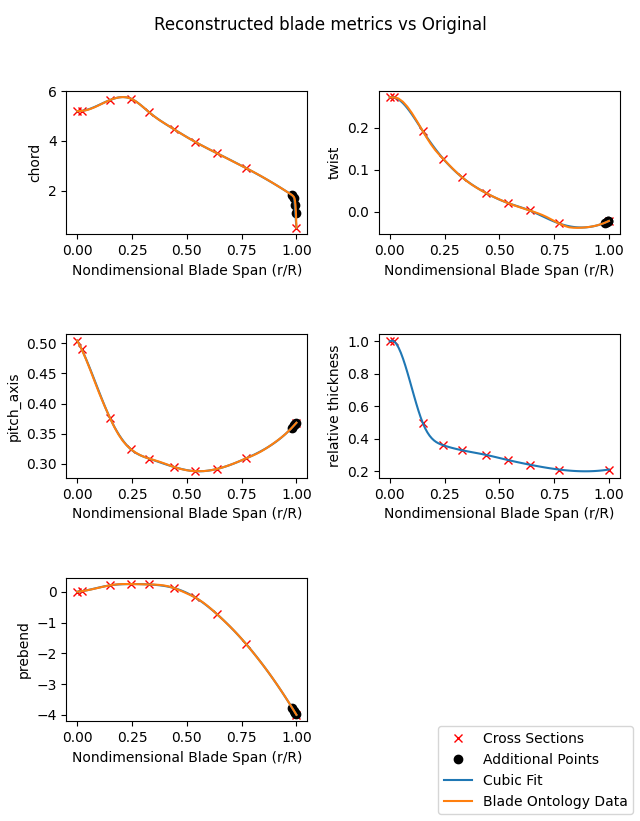

# CFD optimised CAD geometry
___

This CAD geometry has been designed specifically for those wishing to perform high-fidelity CFD of the turbine blade. It has been generated from the original blade ontology file using bi-cubic splines with a couple of minor adjustments users should be aware of:

- The trailing edge has been split to be fully blunt along the entire span. The tip aerofoil sections which closed with a single point were split to remain open, and the 2 point curve was used to form part of the trailing edge surface. 
- Likewise at the root the circular section has been split to remove the vanishing angle- this creates the one noticable difference between this geometry and the original `.step` geometry [here](https://github.com/IEAWindTask37/IEA-15-240-RWT/tree/master/CAD). Since this is around the trailing edge of cylindrical section it was deemed that the effect on the overall CFD performance of the turbine would be negligable.
- All cross sections in the geometry match definided control points in the ontology file.
- The root and tip sections are currently open, but can be closed by creating a surface on the defining boundaries.
- A root cutout for periodic domains is not included.
- The blade by default has the origin at centre of the root, and is set to 0 degree pitch.

The surface was created by extracting the aerofoil sections, defined in `components.blade.outer_beam_shape.airfoil_posistion`  in the ontology file, as well as sections generated using windio2cad at the very tip, to ensure the curvature is captured accurately. In this region the cross sectional geometry matches the original exactly, and the matching of the other metrics via this interpolation is shown below. 

The aforementioned TE corrections are applied, before a cubic B-spline is fit through each cross section. Remaining in parametric space a bi-cubic B-spline surface is then fitted through the cross sections, creating the smooth geometry, removing the inboard notch. This is then exported to `.iges` format and converted to `.step` format. 

Additional help for this work was provided by Jamil Appa from Zenotech LTD, and Jamie Macleod from the University of Bristol Fluids and Aerodynamics Research Group (FARG).